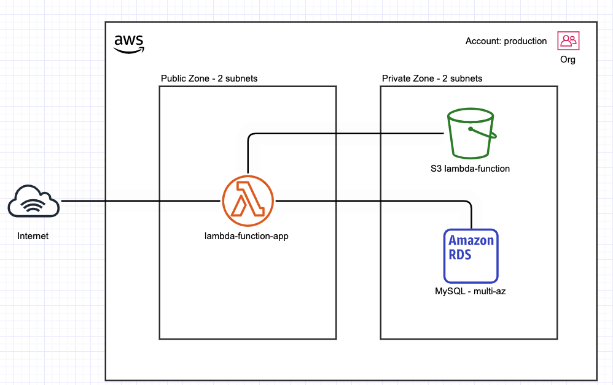

# Terraform AWS Base Assessment

Description: Base AWS Infrastructure for technical assessment of Matheus Bona OÜ



# How to use ?

## 1 - Init
```
make init
```
## 2 - Plan

We have separated commands to plan the infrastructure creation/modification.

### - Development

#### -- Plan (development)
```
make plan-development
```

### - Production

#### -- Plan (production)
```
make plan-production
```

## 3 - Apply

We have separated commands to apply the infrastructure creation/modification.

### - Development

#### -- Apply (development)
```
make apply-development
```

### - Production

#### -- Apply (production)
```
make apply-production
```
## Destroy (optional)

We have separated commands to destroy the infrastructure creation/modification.

### - Development

#### -- Destroy (development)
```
make destroy-development
```

### - Production

#### -- Destroy (production)
```
make destroy-production
```